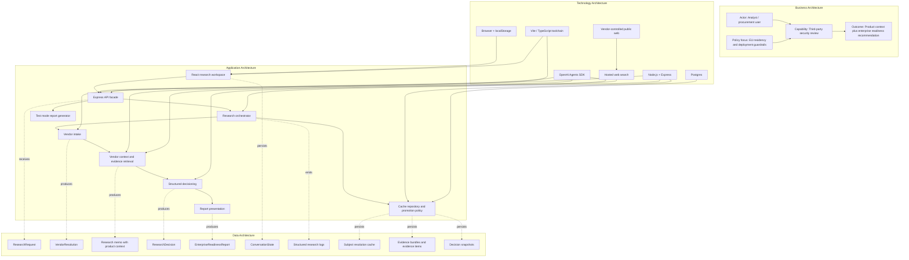
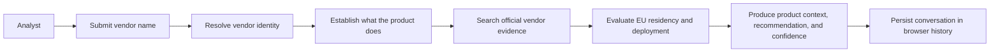
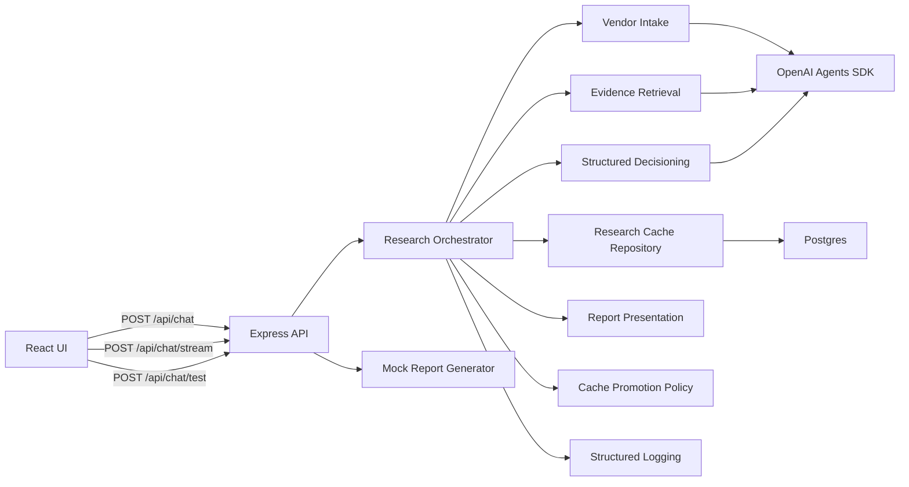
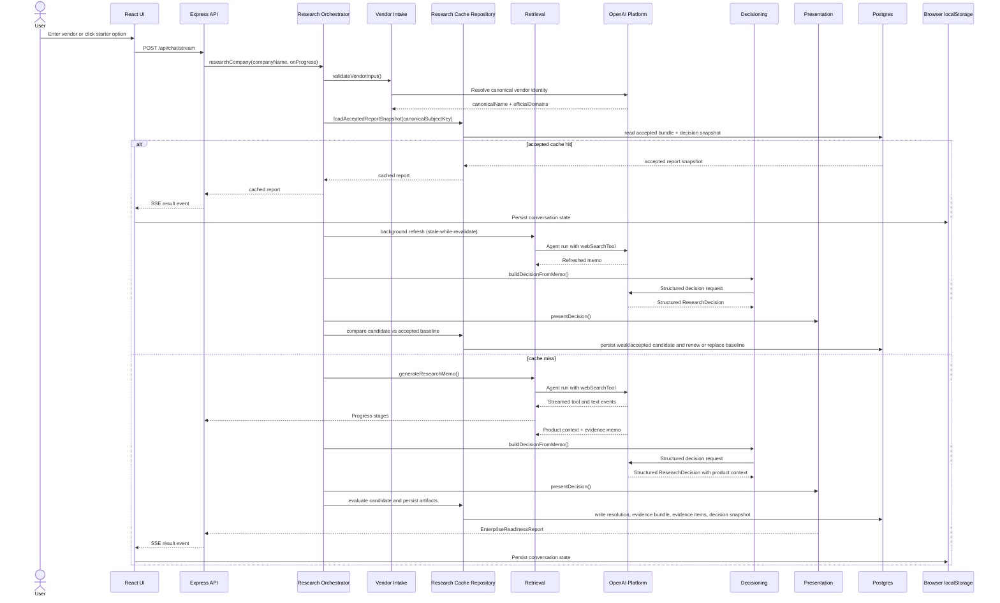
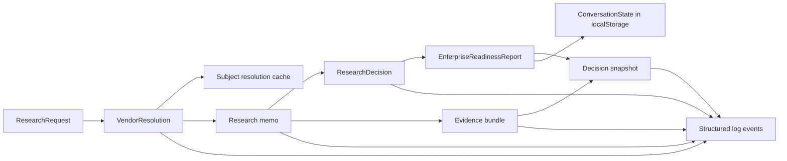
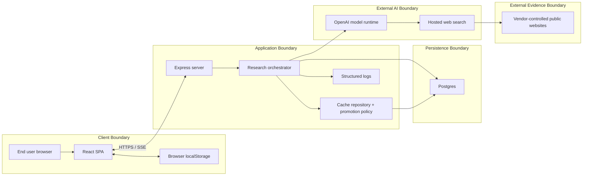

# Architecture

This document describes the current implementation of `ArchReviewAgent` from a TOGAF-style layered architecture perspective. It focuses on the four primary TOGAF architecture domains:

- Business Architecture
- Application Architecture
- Data Architecture
- Technology Architecture

It also includes cross-cutting security controls, runtime flow diagrams, and a pragmatic gap assessment for the next architecture increment.

## 1. Executive Summary

`ArchReviewAgent` is a procurement-oriented vendor assessment application. A user enters a company or product name, and the system performs a security-analyst-style review focused on two enterprise guardrails:

- EU data residency
- Enterprise deployment

Alongside the guardrail verdict, the system also produces a short factual product-context summary that explains what the vendor or product actually does.

The solution is implemented as a single web application with:

- a React single-page frontend
- a Node.js + Express backend
- a staged OpenAI Agents SDK workflow for intake, retrieval, decisioning, and presentation
- a Postgres-backed server-side cache for vendor resolutions, accepted report snapshots, and evidence metadata
- a stale-while-revalidate refresh pattern for cache hits
- browser-local conversation history persisted in `localStorage`

The current production shape is a single deployable web service that can serve both:

- the API
- the built frontend assets

The key architectural choice is separation of concerns in the backend pipeline:

1. Vendor intake and normalization
2. Vendor context and evidence retrieval
3. Structured decisioning
4. Final report presentation

This is materially better than a single free-form agent because it improves:

- consistency
- testability
- guardrail enforcement
- diagnosability

## 2. TOGAF Layered View

## 3. Business Architecture

### 3.1 Business Purpose

The business goal is to reduce procurement risk when evaluating third-party software products. The application supports a lightweight but structured security review before enterprise adoption.

### 3.2 Business Capabilities

| Capability | Description | Current Implementation |
|---|---|---|
| Vendor Intake | Accept a vendor or product name and normalize the request | Frontend composer plus backend intake validation |
| Product Contextualization | Explain what the product or company does before showing the security verdict | Retrieval memo plus report overview section |
| Security Review | Evaluate a vendor against enterprise guardrails | Live research pipeline using OpenAI Agents SDK |
| Evidence-based Recommendation | Convert vendor evidence into a decision with confidence | Structured decisioning plus report presentation |
| Analyst Workflow Visibility | Show the user what stage the research is in | Streamed progress over SSE |
| Conversation Recall | Re-open previous reviews in the same browser | Sidebar backed by `localStorage` |
| UI Validation Mode | Validate UX without paying live research latency | Mock report path via `/api/chat/test` |
| Evidence Continuity | Reuse accepted research and improve it when better evidence appears | Postgres cache plus background refresh |

### 3.3 Business Actors

| Actor | Role |
|---|---|
| Analyst / procurement user | Requests a review and consumes the recommendation |
| ArchReviewAgent | Performs the staged review and renders the result |
| OpenAI platform | Provides model execution and hosted web search |
| Vendor public web presence | Supplies public evidence used in the review |

### 3.4 Business Process View

### 3.5 Business Rules

- Only two business guardrails are currently in scope.
- `unknown` should only be used when the evidence is genuinely too thin.
- Vendor evidence should come from official vendor-controlled domains.
- EU transfer-law language is not equivalent to EU residency support.
- Product context should be factual and grounded in vendor-controlled descriptions, not marketing paraphrase.
- The system should expose evidence and unanswered questions, not only a color verdict.

## 4. Application Architecture

### 4.1 Application Building Blocks

| Building Block | Responsibility | Primary Files |
|---|---|---|
| Research Workspace UI | Chat UI, progress rendering, history sidebar, starter vendors | [src/App.tsx](src/App.tsx), [src/styles.css](src/styles.css) |
| Shared Contract Layer | Defines typed request, response, progress, and report shapes | [shared/contracts.ts](shared/contracts.ts) |
| API Facade | Exposes health, test, sync, and stream endpoints | [server/index.ts](server/index.ts) |
| Research Orchestrator | Coordinates the four backend stages and structured logging | [server/researchAgent.ts](server/researchAgent.ts) |
| Vendor Intake Service | Validates input and resolves canonical vendor identity | [server/research/vendorIntake.ts](server/research/vendorIntake.ts) |
| Retrieval Service | Uses hosted web search to assemble product context and an evidence memo | [server/research/retrieval.ts](server/research/retrieval.ts) |
| Decision Service | Converts memo into a structured security decision | [server/research/decisioning.ts](server/research/decisioning.ts) |
| Presentation Service | Converts decision into the final report contract, including the “What this product does” section | [server/research/presentation.ts](server/research/presentation.ts) |
| Cache Policy Service | Decides whether a refreshed candidate can replace the current accepted baseline | [server/research/cachePolicy.ts](server/research/cachePolicy.ts) |
| Research Cache Repository | Stores subject resolutions, evidence bundles, and decision snapshots | [server/db/researchCacheRepository.ts](server/db/researchCacheRepository.ts) |
| Database Infrastructure | Opens pooled Postgres connections and applies migrations | [server/db/client.ts](server/db/client.ts), [server/db/migrate.ts](server/db/migrate.ts) |
| Test Mode Generator | Returns a deterministic mock report | [server/mockReport.ts](server/mockReport.ts) |
| Logging Utility | Emits structured JSON logs for observability | [server/research/logging.ts](server/research/logging.ts) |

### 4.2 Application Interaction View

### 4.3 Runtime Sequence View

### 4.4 Frontend Responsibilities

The frontend is a single React screen with four primary responsibilities:

- collect the target vendor name
- display what the product does before the security verdict
- display live research progress
- render the final structured report
- persist and restore conversation history in the current browser

Notable frontend behaviors:

- history is local to the browser, not server-backed
- the live path uses SSE and stages the visible progress to avoid abrupt jumps
- test mode bypasses live research and returns a static mock report
- starter vendor buttons accelerate common demo paths

### 4.5 Backend Orchestration Pattern

The backend follows an orchestrated staged pattern instead of a monolithic agent.

| Stage | Input | Output | Why it Exists |
|---|---|---|---|
| Intake | Raw `companyName` | `VendorResolution` | Normalize and constrain vendor identity |
| Retrieval | `VendorResolution` | Research memo | Gather official-domain evidence |
| Decision | Memo + resolution | `ResearchDecision` | Make a structured security decision |
| Presentation | `ResearchDecision` | `EnterpriseReadinessReport` | Produce stable client-facing output |

This separation is important because it:

- isolates guardrails
- improves test coverage
- reduces dependence on free-form parsing
- makes failures diagnosable by stage

This staged flow is now wrapped by a server-side caching shell:

1. resolve canonical subject
2. check for a fresh accepted report snapshot by canonical subject key
3. return cached immediately when present
4. start a background refresh on cache hits
5. compare the refreshed candidate to the accepted baseline before promotion

## 5. Data Architecture

### 5.1 Core Information Objects

| Data Object | Description | Lifecycle |
|---|---|---|
| `ResearchRequest` | Raw user request containing `companyName` | API input only |
| `VendorResolution` | Canonical vendor identity plus allowed domains | Ephemeral backend object and cached server-side |
| Research memo | Semi-structured narrative including product context and guardrail evidence | Ephemeral backend object and cached server-side with the bundle |
| `ResearchDecision` | Structured decision with guardrail assessments | Ephemeral backend object |
| `EnterpriseReadinessReport` | Final UI-facing report, including “What this product does” | Returned to client, persisted in browser messages, and cached server-side |
| `ConversationState` | Browser-local history of threads and messages | Persistent in browser `localStorage` |
| Structured research log event | Stage-level operational trace | Persistent only in stdout / platform logs |
| Subject resolution cache | Maps normalized user inputs to canonical vendor resolution | Persistent in Postgres |
| Evidence bundle | Cached memo plus evidence metadata and bundle status (`accepted`, `weak`, `stale`) | Persistent in Postgres |
| Decision snapshot | Cached final presented report for an accepted or weak bundle | Persistent in Postgres |

### 5.2 Data Flow View

### 5.3 Data Management Characteristics

- The server now uses Postgres for durable caching of subject resolutions, accepted report snapshots, and evidence metadata.
- The backend still keeps stage-local working data in memory for the lifetime of a request.
- The browser stores conversation history per mode in `localStorage`.
- The public report contract is stable and typed in [shared/contracts.ts](shared/contracts.ts).
- Internal stage objects are stricter than the UI contract and use Zod for normalization.
- Accepted report caching is keyed by canonical subject, not the raw typed string.
- Background refresh uses a stale-while-revalidate pattern and only promotes candidates that meet minimum coverage and anti-regression rules.

### 5.4 Data Governance Rules

- Official domains are normalized and deduplicated before retrieval.
- Retrieval is constrained to vendor-controlled domains.
- Decision evidence is normalized before being surfaced to the UI.
- The UI never receives the raw memo; it receives only the presented report.
- Invalid or prompt-like raw input is rejected before any live research.

## 6. Technology Architecture

### 6.1 Technology Stack

| Layer | Technology |
|---|---|
| Client runtime | Browser, React 19, Fetch API, SSE, `localStorage` |
| Client build | Vite, TypeScript |
| Server runtime | Node.js, Express 4, TypeScript |
| Dev runtime | `tsx watch`, `concurrently` |
| AI integration | `@openai/agents`, `openai` |
| Persistence | Postgres, `pg` |
| Local data services | Docker Compose Postgres helper |
| Validation | Zod |
| Observability | Structured JSON logs to stdout |

### 6.2 Deployment View

### 6.3 Runtime Modes

| Mode | Path | Purpose |
|---|---|---|
| Live sync | `POST /api/chat` | Request-response report generation |
| Live stream | `POST /api/chat/stream` | Progress-aware report generation |
| Test mode | `POST /api/chat/test` | Mocked report for UX testing |
| Health | `GET /api/health` | Service liveness check |

### 6.4 Environment Variables

| Variable | Purpose |
|---|---|
| `OPENAI_API_KEY` | Required for live research |
| `OPENAI_MODEL` | Optional override for model selection |
| `RESEARCH_TIMEOUT_MS` | Optional live request budget |
| `DATABASE_URL` | Postgres connection string for server-side caching |
| `EVIDENCE_CACHE_TTL_MS` | TTL for accepted and weak evidence bundles |
| `RESOLUTION_CACHE_TTL_MS` | TTL for cached vendor resolutions |
| `BACKGROUND_REFRESH_COOLDOWN_MS` | Minimum interval between background refreshes for the same canonical subject |
| `PORT` | HTTP listening port |

## 7. Security and Trust Boundaries

### 7.1 Trust Model

The architecture has four meaningful trust zones:

1. Browser input zone
2. Backend application zone
3. OpenAI platform zone
4. Public vendor evidence zone

The system explicitly treats the following as untrusted:

- user-supplied vendor names
- text embedded in retrieved vendor web pages
- malformed or partial model outputs

### 7.2 Implemented Controls

| Control | Intent | Implementation |
|---|---|---|
| Input validation | Reduce prompt injection and malformed requests | `validateVendorInput()` in [server/research/vendorIntake.ts](server/research/vendorIntake.ts) |
| Vendor resolution | Constrain the research target | `resolveVendorIdentity()` |
| Official-domain filtering | Limit retrieval to vendor-controlled evidence | `webSearchTool({ filters.allowedDomains })` in [server/research/retrieval.ts](server/research/retrieval.ts) |
| Stage separation | Avoid one agent owning everything | Intake, retrieval, decision, presentation |
| Structured decision output | Reduce memo parsing fragility | `rawResearchDecisionSchema` and normalization in [server/research/decisioning.ts](server/research/decisioning.ts) |
| Coverage validation | Reject thin or incomplete report outputs | `validateCoverage()` in [server/research/presentation.ts](server/research/presentation.ts) |
| Request time budgeting | Bound runtime and user wait | `RESEARCH_TIMEOUT_MS` handling in [server/researchAgent.ts](server/researchAgent.ts) |
| Canonical-subject cache keys | Avoid split caches for spelling variants and aliases | `normalizeSubjectCacheKey()` and canonical-name lookup in [server/db/researchCacheRepository.ts](server/db/researchCacheRepository.ts) |
| Cache promotion policy | Prevent weaker refreshes from replacing accepted baselines | [server/research/cachePolicy.ts](server/research/cachePolicy.ts) |
| Stale-while-revalidate refresh | Keep user latency low while allowing evidence improvement over time | background refresh scheduling in [server/researchAgent.ts](server/researchAgent.ts) |
| Structured logs | Support diagnostics by phase | [server/research/logging.ts](server/research/logging.ts) |

### 7.3 Current Security Limitations

- No authentication or authorization layer
- No tenant isolation because there is no server-side user model
- No explicit encryption-at-rest policy described at the application level; relies on managed Postgres/runtime controls
- Browser `localStorage` history is device-local and not centrally governed
- Background refresh is in-process, not queue-backed, so it is still tied to a single app instance
- No external policy engine for enterprise control rules

## 8. Architecture Decisions

### 8.1 Key Decisions

| Decision | Rationale | Consequence |
|---|---|---|
| Use a staged backend instead of one monolithic agent | Improves consistency and observability | Slightly more code, but better control |
| Use SSE for live progress | Better user experience during long runs | Requires stream-capable server hosting |
| Keep browser-local history | Fast MVP without a database | No cross-device sync |
| Keep test mode in the same app | Enables rapid UI validation | Requires clear separation from live mode |
| Use official-domain filtering | Improves evidence quality and safety | Can miss evidence if the resolved domain set is incomplete |
| Add Postgres-backed research caching | Stabilizes repeated results and creates a server-side evidence memory | Introduces persistence and migration management |
| Key accepted reports by canonical subject | Prevents spelling variants from fragmenting the cache | Requires vendor resolution before accepted-report lookup |
| Use stale-while-revalidate with promotion rules | Improves freshness without exposing random regressions to users | Refresh work is asynchronous and more complex to reason about |

### 8.2 Architecture Building Blocks vs Solution Building Blocks

| TOGAF ABB | Current SBB |
|---|---|
| Vendor review capability | React chat workspace + Express endpoints |
| Product contextualization capability | Retrieval stage plus report overview rendering |
| AI-driven evidence acquisition | OpenAI Agents SDK retrieval stage with hosted web search |
| Security decision service | Decision agent + Zod normalization |
| Presentation service | Presentation layer producing `EnterpriseReadinessReport` |
| Evidence continuity capability | Postgres cache repository plus promotion policy |
| Interaction history | Browser `localStorage` conversation store |
| Operational telemetry | Structured JSON console logs |

## 9. Non-Functional Characteristics

### 9.1 Performance

- The dominant latency is external model and search work, not local compute.
- The UI mitigates latency with streamed progress stages.
- Test mode provides a near-instant UX fallback for demo and validation scenarios.
- Accepted cache hits are now near-instant compared with live research.
- Background refresh shifts freshness work off the critical request path.

### 9.2 Reliability

- The system uses stage-level time budgeting.
- Retrieval can retry once on retryable model failures.
- Decision output is normalized and repaired when the model returns malformed JSON.
- The system returns specific user-facing error classes for common failure modes.
- Accepted baselines are retained when a refreshed candidate is weaker or thinner.

### 9.3 Testability

- The backend has stage-level tests for intake, retrieval, decisioning, presentation, and logging.
- The backend now also has explicit cache-promotion policy tests.
- Shared report structures reduce drift between stages.
- The application contract is centralized in [shared/contracts.ts](shared/contracts.ts).

### 9.4 Maintainability

- The staged architecture is easier to reason about than a single large agent.
- The current codebase has a clear module boundary for each backend concern.
- The current maintenance hotspot is now around distributed background refresh and eventual worker separation, not cache correctness.

## 10. Gap Assessment and Target-State Considerations

From a TOGAF perspective, the current solution is a strong MVP architecture but not yet a full enterprise platform.

### 10.1 Current-State Strengths

- Clear separation of business workflow and application services
- Typed contracts between frontend and backend
- Stronger-than-average trust handling for user input and public evidence
- Good developer observability for a single-service app

### 10.2 Current-State Gaps

| Domain | Gap | Impact |
|---|---|---|
| Business | No multi-user workflow, approvals, or policy ownership model | Limits enterprise operating model |
| Data | No full analytical evidence warehouse or user-facing audit UI | Limited historical reporting and governance workflows |
| Application | Background refresh is in-process rather than queue-backed | Refresh reliability is tied to a single app instance |
| Technology | Single-node refresh scheduler and web-service-only runtime | Limited horizontal scale and resilience |
| Security | No auth, RBAC, or tenant isolation | Not suitable for broad internal rollout yet |

### 10.3 Logical Next Architecture Increment

The most natural next-state architecture would add:

- authenticated users
- server-side persistent conversation and evidence storage
- queue-backed background research jobs with polling or event updates
- richer evidence-bundle comparison and audit views
- administrative policy configuration for additional guardrails
- centralized monitoring and log aggregation

## 11. Summary

From a TOGAF viewpoint, `ArchReviewAgent` is currently a layered digital solution with:

- a clear business capability for third-party security review
- a modular application architecture centered on a four-stage research pipeline wrapped by a cache-and-refresh shell
- a data architecture with typed artifacts, browser-local history, and Postgres-backed accepted evidence/report caching
- a lightweight technology architecture optimized for a single deployable web service plus managed Postgres

Its strongest architectural qualities are:

- staged decomposition
- evidence-focused decisioning
- canonical-subject caching with anti-regression promotion rules
- explicit trust-boundary controls
- strong contract discipline between layers

Its main limitations are architectural scale concerns rather than code organization concerns:

- no shared persistence
- no asynchronous job backbone
- no enterprise identity or governance layer

As an MVP, the architecture is coherent and well-shaped. As an enterprise service, the next major evolution should be in persistence, identity, and asynchronous workload handling rather than another rewrite of the current layered core.
