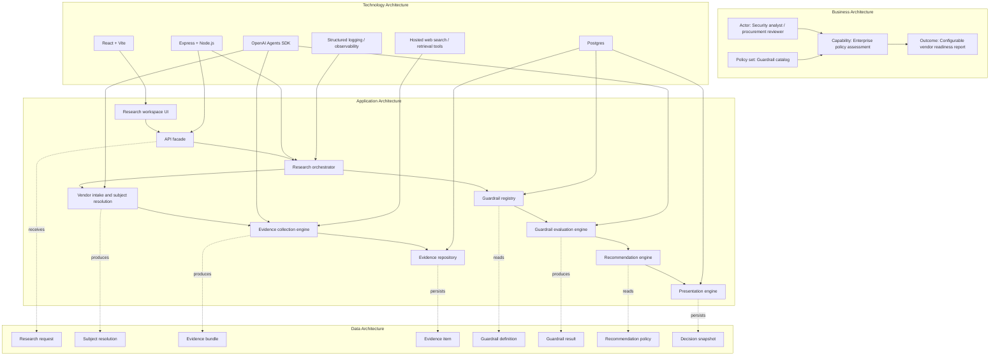
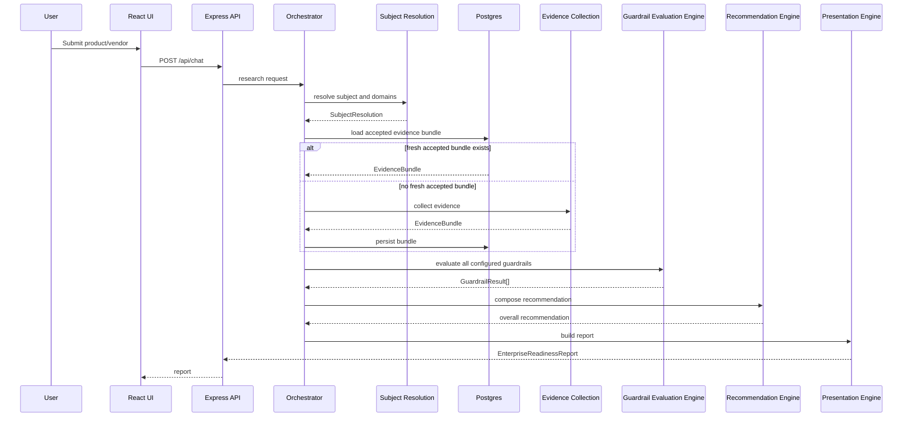

# Extensible Guardrail Architecture

This document describes the target-state architecture for evolving `ArchReviewAgent` from a fixed two-guardrail product into a configurable enterprise policy assessment platform.

It is intentionally separate from [architecture.md](../architecture.md), which describes the current production system. This document captures the next architecture shape for future releases.

## 1. Why This Exists

The current application evaluates two hardcoded guardrails:

- EU data residency
- Enterprise deployment

That is a good product starting point, but it does not scale cleanly if future releases need additional rules such as:

- data retention controls
- audit logging support
- SSO and SCIM maturity
- BYOK / customer-managed encryption
- private networking
- HIPAA or FedRAMP posture
- model training / data usage restrictions
- geographic availability by region

If new rules are added by copying the current implementation pattern, the system will become:

- harder to test
- slower to evolve
- harder to cache consistently
- more difficult to reason about at the recommendation layer

The target architecture should treat guardrails as configuration and policy, not as hardcoded branches in the backend.

## 2. Target Outcome

The architecture should support:

1. collecting vendor evidence once
2. evaluating many guardrails against that shared evidence bundle
3. composing a final recommendation from a configurable policy model
4. rendering a report from a dynamic guardrail set rather than a fixed two-card layout

The core design principle is:

`collect once, evaluate many`

This keeps web retrieval cost bounded while allowing the rule set to grow.

## 3. TOGAF Layered View



## 4. Architecture Shift

### 4.1 Current Pattern

Today the effective flow is:

```text
subject -> retrieval -> decision -> presentation
```

That works well for two rules, but it becomes brittle when each new rule adds more bespoke parsing or UI rendering.

### 4.2 Target Pattern

The extensible shape should be:

```text
subject
  -> subject resolution
  -> evidence collection
  -> evidence bundle
  -> N guardrail evaluators
  -> recommendation engine
  -> presentation
```

This introduces two explicit layers that do not fully exist today:

- a `Guardrail Registry`
- a `Recommendation Engine`

## 5. Core Building Blocks

### 5.1 Subject Resolution

Responsibility:

- normalize the requested product or vendor name
- identify canonical ownership
- determine trusted first-party domains
- preserve product-level subject specificity when the owner is broader

Output:

- `SubjectResolution`

Example:

```ts
type SubjectResolution = {
  requestedSubject: string;
  canonicalSubject: string;
  canonicalVendor: string;
  officialDomains: string[];
  confidence: 'high' | 'medium' | 'low';
};
```

### 5.2 Evidence Collection Engine

Responsibility:

- discover and retrieve candidate vendor evidence
- normalize it into a structured bundle
- deduplicate and timestamp evidence
- persist it for reuse and re-evaluation

Important design rule:

- evidence should be collected independently of any single guardrail whenever possible

Example:

```ts
type EvidenceItem = {
  id: string;
  url: string;
  title: string;
  publisher: string;
  sourceType: 'primary' | 'secondary';
  retrievedAt: string;
  excerpt: string;
  language?: string;
};

type EvidenceBundle = {
  id: string;
  subjectKey: string;
  subjectResolution: SubjectResolution;
  collectedAt: string;
  items: EvidenceItem[];
};
```

### 5.3 Guardrail Registry

Responsibility:

- define each guardrail as data
- drive evaluation prompts and UI labels
- classify guardrails as required, weighted, optional, or informational

Example:

```ts
type GuardrailDefinition = {
  id: string;
  label: string;
  description: string;
  required: boolean;
  category: 'security' | 'compliance' | 'commercial' | 'operations';
  evaluationPrompt: string;
  evidenceHints: string[];
  freshnessTtlMs?: number;
};
```

This is the key extensibility point.

Adding a new rule should mostly mean:

1. define a new `GuardrailDefinition`
2. optionally add retrieval hints
3. update recommendation policy if the new rule is decision-relevant

It should not require custom orchestration code each time.

### 5.4 Guardrail Evaluation Engine

Responsibility:

- evaluate one guardrail against the shared evidence bundle
- return a standardized result shape
- remain isolated from the final overall recommendation

Example:

```ts
type GuardrailResult = {
  id: string;
  label: string;
  status: 'supported' | 'partial' | 'unsupported' | 'unknown';
  confidence: 'high' | 'medium' | 'low';
  summary: string;
  risks: string[];
  evidence: EvidenceItem[];
};
```

Each rule can use:

- the same evaluation agent with different prompt instructions
- or a specialized evaluator if a rule later needs domain-specific logic

The contract stays constant either way.

### 5.5 Recommendation Engine

Responsibility:

- convert many `GuardrailResult` values into a single recommendation
- apply weighting and blocking logic
- explain why the overall outcome is green, yellow, or red

Example:

```ts
type RecommendationPolicy = {
  blockingGuardrails: string[];
  weightedGuardrails: Array<{ id: string; weight: number }>;
  downgradeRules: string[];
};
```

This keeps the overall verdict from being hidden inside each rule evaluator.

### 5.6 Presentation Engine

Responsibility:

- render a dynamic set of guardrails
- keep product context separate from rule evaluation
- generate executive summary, next steps, and unanswered questions

The UI should no longer assume exactly two guardrail cards.

Instead it should render:

- product context
- recommendation summary
- dynamic guardrail sections
- grouped next steps

## 6. Runtime Flow



## 7. Data Architecture

The current Postgres model already introduces a useful foundation:

- subject resolution cache
- evidence bundles
- evidence items
- decision snapshots

To extend this cleanly, future schema additions should include:

### 7.1 Guardrail Definitions

Persisted table or config-backed structure:

- `guardrail_definitions`
- versioned definitions if prompts or semantics change

Suggested fields:

- `id`
- `label`
- `description`
- `required`
- `category`
- `evaluation_prompt`
- `evidence_hints`
- `enabled`
- `version`

### 7.2 Recommendation Policies

Persist a policy table or versioned config:

- `recommendation_policies`

Suggested fields:

- `version`
- `policy_json`
- `created_at`

### 7.3 Guardrail Result Snapshots

Instead of baking all rule results only into the final report JSON, persist them individually:

- `guardrail_result_snapshots`

Suggested fields:

- `decision_snapshot_id`
- `guardrail_id`
- `status`
- `confidence`
- `summary`
- `risks_json`
- `evidence_item_ids_json`

This allows:

- retrospective re-scoring
- audit trails
- future UI comparisons across releases

## 8. Caching and Refresh Model

The current cache model is already moving in the right direction.

The target-state extension should preserve these principles:

- accepted evidence should be reused for consistency
- weak evidence should not displace an accepted baseline
- background refresh should improve evidence opportunistically
- manual refresh should remain available

For a multi-guardrail future, promotion logic should compare:

- evidence coverage breadth
- evidence freshness
- per-guardrail unknown rates
- decision stability

The cache should be tied to:

- canonical subject key
- evidence bundle version
- guardrail registry version
- recommendation policy version

That avoids mixing old evidence with new policy semantics.

## 9. UI Architecture Implications

The frontend should evolve from:

- a fixed two-card report

to:

- a report generated from a guardrail array

Suggested UI model:

```ts
type GuardrailResultView = {
  id: string;
  label: string;
  status: string;
  confidence: string;
  summary: string;
  risks: string[];
  evidence: EvidenceItem[];
};
```

Then render:

- `What this product does`
- executive summary
- recommendation pill
- dynamic guardrail grid or grouped sections
- next steps

This keeps future rule additions mostly backend- and config-driven.

## 10. Non-Functional Design Requirements

### 10.1 Extensibility

Adding a new guardrail should require:

- adding a registry definition
- optionally updating recommendation policy
- minimal or no UI code changes

### 10.2 Consistency

Given the same accepted evidence bundle and the same policy version, the system should produce a stable recommendation envelope.

### 10.3 Auditability

The system should be able to answer:

- what evidence was used
- which guardrails were active
- which recommendation policy version was applied
- when the decision was made

### 10.4 Testability

Each layer should be testable independently:

- subject resolution
- evidence collection
- guardrail evaluation
- recommendation composition
- presentation

## 11. Migration Path From Current State

The safest path is incremental.

### Phase 1

Refactor the current report contract from:

- fixed `euDataResidency`
- fixed `enterpriseDeployment`

to:

- `guardrails: GuardrailResult[]`

while still registering only those two rules.

### Phase 2

Introduce a `GuardrailRegistry` module that defines the current two rules as data.

### Phase 3

Make the decision engine evaluate the active guardrail registry rather than a fixed pair.

### Phase 4

Add a recommendation policy layer that composes final recommendations from rule results.

### Phase 5

Persist versioned guardrail definitions and recommendation policies.

### Phase 6

Add new rules gradually, starting with rules that can reuse the same evidence corpus.

## 12. Recommended Repo Capture

The best way to capture this for future releases is:

1. keep [architecture.md](../architecture.md) as the current-state document
2. keep this document as the target-state extensibility design
3. when implementation starts, add ADRs for major decisions such as:
   - moving to dynamic guardrail arrays
   - versioning recommendation policies
   - persisting per-guardrail result snapshots

So the better capture is not replacing the current architecture document.

It is:

- current-state architecture
- target-state extension architecture
- ADRs for irreversible design decisions

That gives the repo both present-state clarity and future-state direction.
